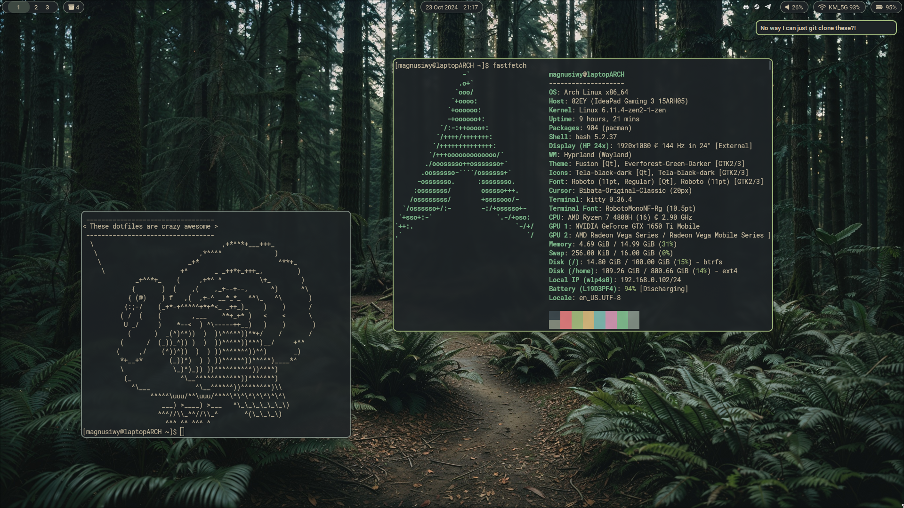
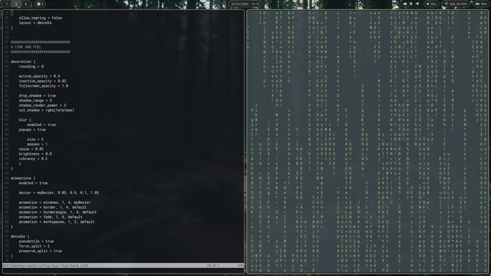
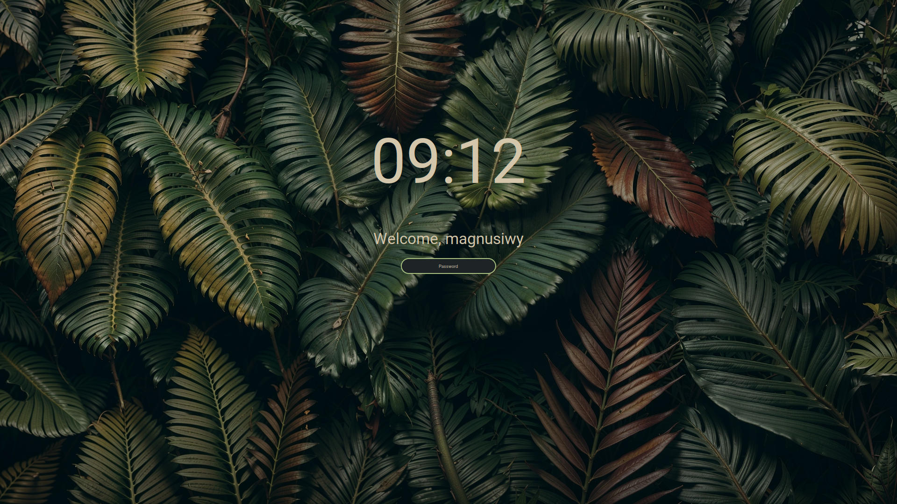
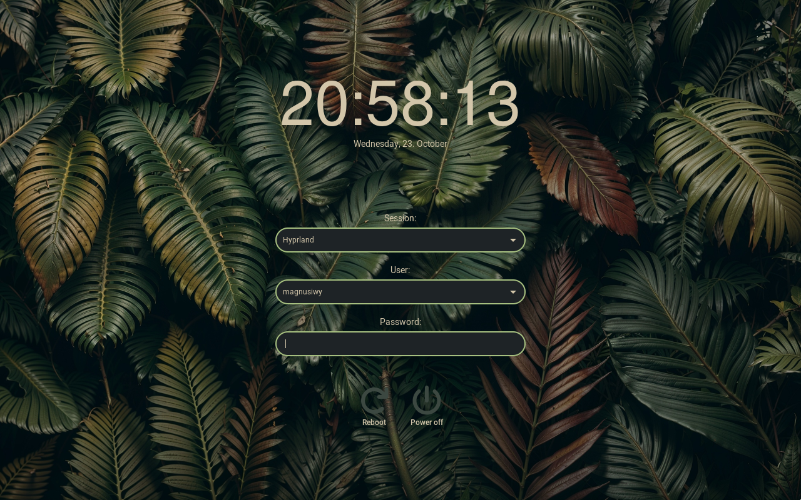

# Dotfiles for [Hyprland](https://github.com/hyprwm/Hyprland) Tiling Window Manager (only for Arch based distros)

# Installation

### With an installation script

__As I am still one of the new Linux users I have to say that you shouldn't use the script before checking it out. If you're new to Linux - DON'T TRUST EVERY SCRIPT YOU FIND ON THE INTERNET. Most of the open source projects won't hurt you but you still should be cautious__

To use the dotfiles you need some packages (some of them listed below with a short explanation why you need them). You can easily start using the dotfiles by installing them with the `install.sh` script. You can find it in the _scripts_ folder. It's role is to install all of the packages that are needed to use the dotfiles, link the config files where they need to be, link the appearance packages to their respective directories and copy whatever needs to be copied to other directories under root. Everything that has to be copied to either _/etc_ or _/usr_ is needed so that the greeter/login manager would work. Cursor theme and fonts are unmodified however the GTK theme has been slightly changed (darker background). The script also copies the grub theme and `40_custom` file to grub config (for restart and shutdown buttons in the grub menu). For the grub theme to work after running the script you need to change the theme in _/etc/default/grub_ and update the grub with `sudo grub-mkconfig -o /boot/grub/grub.cfg`.

We also need to set the theme and the cursor if Hyprland fails to do so in a separate _nwg-look_ app. What Hyprland cannot change is the default font and icons that you can find in GTK settings (_nwg-look_) and QT6 settings (_qt6ct_) apps.

### Manually
If you link the config files to where they should be, you can just `git pull` after the config gets an update and get the latest changes. If any files have been added, just run `install.sh` once again (it will not try to install anything you already have, it will not link anything if files exist and it will not copy files that haven't changed). If you just copy all of the files, you will have to copy them again with each dotfiles update so be ready to do that each time.

__Set your own dotfilesHyprland directory if needed__

Link/copy the files from _config_ to your `$HOME/.config` directory. Here's how you can link them to easily apply any updates with just one `git pull`:

```
ln -s ~/dotfilesHyprland/config/* ~/.config/
```

Do the same for the files from _appearance_ and link them to your `$HOME` directory:

```
ln -s ~/dotfilesHyprland/appearance/.* ~/
```

Now's the hard part. You need to COPY (links might not work properly and they probably won't) the greeter files to where they belong in _/etc_ and _/usr/share/nwg-hello_:

```
sudo cp -r ~/dotfilesHyprland/appearance/.fonts/Roboto* /usr/share/fonts/
sudo cp -r ~/dotfilesHyprland/appearance/.themes/Everforest-Green-Darker /usr/share/themes/
sudo cp -r ~/dotfilesHyprland/appearance/.icons/Bibata-Original-Classic /usr/share/icons/
sudo cp -r ~/dotfilesHyprland/appearance/.icons/Tela-black-dark /usr/share/icons/
sudo cp ~/dotfilesHyprland/greeter/nwg-hello/* /etc/nwg-hello/
sudo cp ~/dotfilesHyprland/greeter/greetd/* /etc/greetd/
sudo cp ~/dotfilesHyprland/greeter/icons/* /usr/share/nwg-hello/
```

Copy the grub theme from _grub_ to _/boot/grub/themes_ and copy the `40_custom` file with the custom menu settings to _/etc/grub.d/_:

```
sudo cp -r ~/dotfilesHyprland/grub/whatever_theme /boot/grub/themes/
sudo cp ~/dotfilesHyprland/grub/custom_40 /etc/grub.d/
```

After doing all that you also have to edit the _/etc/default/grub_ file and set the grub theme there.


# Some packages explained:
 - [hyprlock](https://github.com/hyprwm/hyprlock) (lock screen)
 - [hypridle](https://github.com/hyprwm/hypridle) (idle management)
 - [greetd](https://github.com/kennylevinsen/greetd) and [nwg-hello](https://github.com/nwg-piotr/nwg-hello) (Greeter / login manager and it's GTK GUI)
 - [rofi-wayland](https://github.com/lbonn/rofi) (dmenu - Roboto Mono Nerd Font needed)
 - [mako](https://github.com/sqlalchemy/mako) (notifications)
 - [ranger](https://github.com/ranger/ranger) (TUI file manager)
 - [kitty](https://github.com/kovidgoyal/kitty) (terminal)
 - [polkit-gnome](https://gitlab.gnome.org/Archive/policykit-gnome) (graphical authentication thingy)
 - [nwg-look](https://github.com/nwg-piotr/nwg-look) (GUI to set the GTK theme)
 - [grim](https://github.com/emersion/grim) and [slurp](https://github.com/emersion/slurp) (screenshot utilities)
 - [calcurse](https://github.com/lfos/calcurse) (terminal calendar)
 - [blueman](https://github.com/blueman-project/blueman) (GUI for handling bluetooth devices)
 - qt6ct, qt5-wayland, qt6-wayland (GUI's to set the QT theme and the libraries for qt apps)
 - pacman-contrib (needed for checkupdates widget)
 - [brightnessctl](https://github.com/Hummer12007/brightnessctl) (Changing the brightness)


# Some additional info
The bar is divided into segments:
 - LEFT: Workspaces, Updates Checker (pacman-contrib has to be installed)
 - MIDDLE: Clock and Calendar
 - RIGHT: System Tray, Sound, Bluetooth (disappears if disabled), WiFi, Battery (disappears if disabled)

The sound widget opens the _pavucontrol_ app on right click. You can change the volume with mouse scroll and mute the sound with left click. WiFi widget opens _nm-connection-editor_ and bluetooth widget opens _blueman-manager_. Also, calendar widget opens _calcurse_ and checkupdates widget opens your terminal with a custom script that'll show you the updates from _yay_ (if installed) and _pacman_. You can also update your system by left clicking it (runs `yay -Syu` if _yay_ installed. Otherwise runs `sudo pacman -Syu`).


# Theming:
 - [Everforest theme](https://github.com/sainnhe/everfores) (GTK only)
 - [Bibata Original Classic](https://github.com/ful1e5/Bibata_Cursor) Cursor Theme
 - [Tela Black Dark](https://github.com/vinceliuice/Tela-icon-theme) Icon theme
 - [Roboto](https://github.com/googlefonts/roboto) Font
 - [RobotoMono Nerd Font](https://www.nerdfonts.com/contributors) 
 - [FontAwesome](https://github.com/FortAwesome/Font-Awesome) Font


# Screenshots





Lockscreen (hyprlock):



Login prompt (greetd + nwg-hello):



#### Thanks to all the people that have made the amazing software I'm using on a daily basis. Thanks to you, developers spending these tens or hundreds of hours have been an amazing adventure
